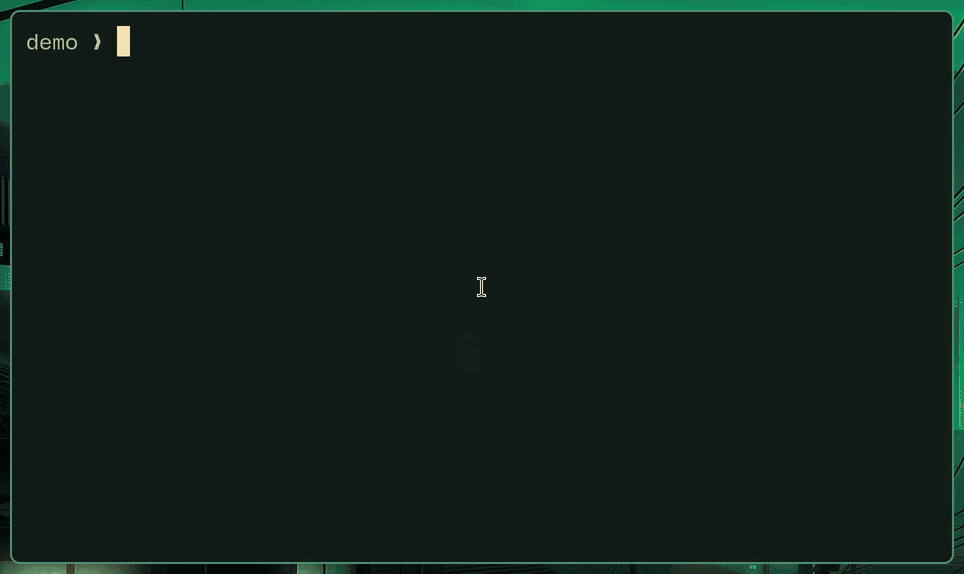

# SnipExpand

Fast, config-based text expansion for Linux and Wayland. **First-class support for [Omarchy](https://omarchy.org) and [Hyprland](https://hypr.land).**

[](https://github.com/silouanwright/snipexpand/actions/workflows/ci.yml)
[](https://github.com/silouanwright/snipexpand/actions/workflows/release.yml)
[](LICENSE)

<p>
  <a href="docs/assets/hero-demo.mp4">
    
  </a>
</p>

Type a short trigger such as `;mail` and SnipExpand replaces it with the text
you configured. Expansions work across applications without modifying the
clipboard or requiring editor-specific plugins.

## Why SnipExpand?

SnipExpand is built around one job: dependable text expansion on Omarchy and
Hyprland. It captures input through Linux input devices and keeps a native
Wayland virtual keyboard open for fast, clipboard-free expansion. Unlike tools
that launch an injector for each replacement or paste through the clipboard,
the normal expansion path is persistent and can run with no per-character
delay.

Configuration remains ordinary YAML that can be searched, reviewed, backed up,
and versioned with Git. SnipExpand reloads it automatically, rejects unsupported
configuration instead of silently ignoring it, and provides commands for
validation, application detection, status, and setup diagnostics.

The daemon does not execute commands from snippets, contact online services, or
read and replace clipboard contents. Its focused scope keeps the
security-sensitive input path smaller and easier to audit.

## Features

- Immediate or terminator-based expansion
- Plain text and multiline replacements
- Cursor placement with `$|$`
- Recursive YAML configuration with automatic reload
- Multiple triggers for one replacement
- Word boundaries, case propagation, and date variables
- Immediate Backspace undo for simple expansions
- Application exclusions
- Persistent Wayland injection with a `uinput` fallback
- Strict validation and diagnostics

SnipExpand focuses on dependable text expansion. It does not currently run
scripts, display forms, insert rich content, or provide a package registry.
See the [compatibility matrix](docs/compatibility.md) for exact details.

## Alternatives

| Project | Strengths | Why choose SnipExpand instead |
| --- | --- | --- |
| [Espanso](https://espanso.org) | Mature, cross-platform automation with forms, scripts, and packages | First-class Omarchy and Hyprland support, built and tested around reliable Wayland input and injection where Espanso can be unreliable |
| [Taurine](https://github.com/ereinaimer/taurine) | Broad cross-platform Rust automation with a TUI, regex, scripts, conversions, and optional AI | GPL-licensed open source, Git-friendly YAML, persistent clipboard-free Wayland injection, and a smaller local-only security surface |
| [FlitKey](https://github.com/swarajnandedkar/FlitKey) | A Python and PyQt graphical expander with hotkeys, a picker, imports, and expansion packs | Actual typed expansion on Wayland instead of a copy-and-paste picker, plus automatic YAML reload and no Python GUI runtime |
| [AutoKey for Wayland](https://github.com/dlk3/autokey-wayland) | Mature GUI automation and Python scripting | Hyprland support, a native Rust daemon, and no Python or desktop-extension runtime; AutoKey's Wayland fork currently supports GNOME only |
| [Texpand](https://github.com/andresousadotpt/texpand) | Lightweight Go-based Wayland expansion with YAML configuration and cursor placement | A native Rust implementation, persistent Wayland injection, strict validation, application exclusions, diagnostics, and service management |
| [text-expander-wayland](https://github.com/quantavil/text-expander-wayland) | A small Rust expander with Espanso-style YAML, dynamic variables, and optional AI | A persistent injector instead of per-operation `wtype` or `ydotool`, automatic reload, layout-aware input, an unprivileged user service, and stricter diagnostics |
| [SRKT](https://github.com/aaaorg/srkt) | A small Rust foundation for Wayland text expansion | Espanso-style YAML, multiline matches, cursor placement, automatic reload, application exclusions, validation, and broader runtime tooling |

## Requirements

- Linux with a Wayland session
- Read access to `/dev/input/event*`
- `libxkbcommon` and Wayland client libraries
- Membership in the system `input` group, or equivalent permissions
- `wtype` for the Unicode fallback path

Hyprland is the supported and tested compositor. Other Wayland compositors may
work but are not yet part of the supported test matrix.

## Install

Install from crates.io:

```bash
cargo install snipexpand
```

Without a Rust toolchain, download the latest prebuilt x86_64 binary:

```bash
mkdir -p ~/.local/bin
curl -L https://github.com/silouanwright/snipexpand/releases/latest/download/snipexpand-x86_64-linux \
  -o ~/.local/bin/snipexpand
chmod +x ~/.local/bin/snipexpand
```

Each [GitHub Release](https://github.com/silouanwright/snipexpand/releases)
also includes an aarch64 binary and SHA-256 checksums.

Building from source requires `libxkbcommon-dev` and `libwayland-dev` on
Debian or Ubuntu, or `libxkbcommon` and `wayland` on Arch Linux.

## Set up

```bash
snipexpand install
snipexpand doctor
```

SnipExpand creates missing starter configuration on first use without
overwriting existing files. The install command starts the service and enables
it for future graphical sessions. If `doctor` reports missing input-device
access, follow the permission command it provides and log out and back in once.

## Hot reloading

<p>
  <a href="docs/assets/live-reload.mp4">
    
  </a>
</p>

## Configure

Add a simple expansion from the command line:

```bash
snipexpand add ';mail' 'user@example.com'
```

For advanced matches, create or edit a YAML file below
`~/.config/snipexpand/match/`:

```yaml
global_vars:
  - name: today
    type: date
    params:
      format: "%Y-%m-%d"

matches:
  - triggers: [";mail", ";email"]
    replace: "user@example.com"

  - trigger: ";sig"
    word: true
    replace: |
      Best regards,
      Your Name

  - trigger: ";function"
    replace: |
      fn example() {
          $|$
      }

  - trigger: ";today"
    replace: "{{today}}"
```

The first `$|$` marker is removed and the cursor is placed at that position.
Match files reload automatically when saved.

Settings live in `~/.config/snipexpand/config.yml`:

```yaml
trigger_mode: space
terminators: [space, enter]
injection_backend: auto
injection_delay_ms: 1
wayland_injection_delay_ms: 0
uinput_injection_delay_ms: 1
injection_settle_ms: 10
undo_enabled: true
app_exclusions:
  - class: "^1Password$"
  - class: "^org\\.keepassxc\\.KeePassXC$"
```

`trigger_mode` can be `immediate` or `space`. Space mode waits for a
configured Space, Enter, or Tab terminator. Immediate mode expands as soon as
the trigger is complete.

`injection_backend: auto` prefers persistent Wayland injection and uses
`uinput` when the compositor does not expose the required protocol. Adjust
the timing values if a particular application drops or reorders keystrokes.

Run `snipexpand detect` while an application is focused to find the title,
class, and executable values needed for an exclusion.

## Commands

```text
snipexpand                       Run the daemon in the foreground
snipexpand init                  Explicitly create starter configuration
snipexpand add TRIGGER TEXT      Add or replace a generated expansion
snipexpand remove TRIGGER        Remove a generated expansion
snipexpand list                  List triggers and source files
snipexpand check                 Validate configuration
snipexpand detect                Inspect the focused application
snipexpand reload                Reload the running daemon
snipexpand status                Show daemon and configuration status
snipexpand status --json         Emit status as JSON
snipexpand doctor                Diagnose setup and runtime requirements
snipexpand install               Install and start the user service
```

Useful service commands:

```bash
systemctl --user status snipexpand
journalctl --user -u snipexpand -f
```

## Undo

Press Backspace immediately after a plain, single-line expansion to restore its
trigger. Multiline and cursor-positioned expansions do not arm undo because the
cursor state is ambiguous.

## Security

SnipExpand reads physical keyboard events through Linux input devices. A
process with this access can observe keyboard input across applications,
including sensitive text. Install only binaries you trust.

Application exclusions prevent expansion in matching applications, but they do
not stop the daemon from receiving keyboard events. SnipExpand cannot determine
whether a browser currently has a password field focused.

SnipExpand does not execute commands from match files and does not read or
modify the clipboard.

## Documentation

- [Espanso compatibility](docs/compatibility.md)
- [Roadmap](docs/espanso-roadmap.md)

## Development

```bash
cargo fmt --check
cargo clippy --all-targets -- -D warnings
cargo test
```

## License

[GNU General Public License v3.0 or later](LICENSE). Distributed modifications
must remain open source under GPL-compatible terms. Private use and modification
do not require publishing source code.
