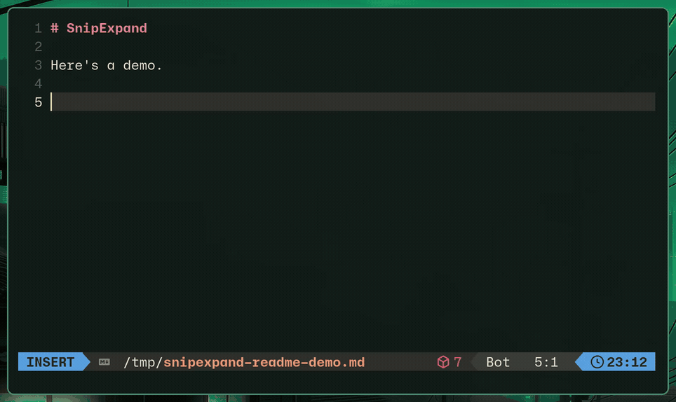

# SnipExpand

Fast, config-based text expansion for Linux and Wayland. **First-class support for [Omarchy](https://omarchy.org) and [Hyprland](https://hypr.land).**

[](https://github.com/silouanwright/snipexpand/actions/workflows/ci.yml)
[](https://github.com/silouanwright/snipexpand/actions/workflows/release.yml)
[](LICENSE)

<p>
  <a href="docs/assets/hero-demo.mp4">
    
  </a>
</p>

## Features

- System-wide, clipboard-free expansion
- Immediate or terminator-based expansion
- Plain text and multiline replacements
- Cursor placement with `$|$`
- Recursive YAML configuration with automatic reload
- Multiple triggers for one replacement
- Word boundaries, case propagation, and date variables
- Immediate Backspace undo for simple expansions
- Application exclusions
- Persistent Wayland injection with a `uinput` fallback
- Strict validation and diagnostics

SnipExpand does not run scripts, display forms, insert rich content, or provide
a package registry. See the [compatibility matrix](docs/compatibility.md).

## Why SnipExpand?

Text expansion on Omarchy and Hyprland is still unreliable or awkward.
SnipExpand was built specifically to work well there. Compare it with the
alternatives below.

## Alternatives

| Project | Strengths | Why choose SnipExpand instead |
| --- | --- | --- |
| [Espanso](https://espanso.org) | Cross-platform automation, forms, scripts, and packages | A reliable native Wayland path built for Omarchy and Hyprland |
| [Taurine](https://github.com/ereinaimer/taurine) | Cross-platform Rust automation with scripts, conversions, and optional AI | A local-only core, YAML configuration, persistent Wayland injection, and GPL licensing |
| [FlitKey](https://github.com/swarajnandedkar/FlitKey) | A graphical picker with hotkeys, imports, and expansion packs | Typed Wayland expansion instead of copy and paste, with no Python GUI runtime |
| [AutoKey for Wayland](https://github.com/dlk3/autokey-wayland) | GUI automation and Python scripting | Hyprland support and a native Rust daemon; AutoKey's Wayland fork targets GNOME |
| [Texpand](https://github.com/andresousadotpt/texpand) | Lightweight Go, YAML, and cursor placement | Rust, persistent Wayland injection, validation, exclusions, and diagnostics |
| [text-expander-wayland](https://github.com/quantavil/text-expander-wayland) | Rust, Espanso-style YAML, variables, and optional AI | Persistent injection instead of launching `wtype` or `ydotool` for each expansion |
| [SRKT](https://github.com/aaaorg/srkt) | A small Rust foundation for Wayland expansion | YAML, multiline matches, cursor placement, reloads, exclusions, and runtime tooling |

## Requirements

Omarchy includes everything SnipExpand needs by default. On other Wayland
systems, you need:

- `libxkbcommon` and Wayland client libraries
- Read access to `/dev/input/event*`, usually through the system `input` group
- `wtype` for the Unicode fallback path

Hyprland is the supported and tested compositor. Other Wayland compositors may
work but are not yet part of the supported test matrix.

## Install

Install from crates.io:

```bash
cargo install snipexpand
```

Prebuilt x86_64 and aarch64 binaries are available from
[GitHub Releases](https://github.com/silouanwright/snipexpand/releases).

## Set up

```bash
snipexpand install
snipexpand doctor
```

First use creates any missing starter files without overwriting your config.
`install` starts the service and enables it for future sessions. If `doctor`
reports missing input access, follow its instructions once.

## Configure

Add a simple expansion from the command line:

```bash
snipexpand add ';mail' 'user@example.com'
```

For advanced matches, create or edit a YAML file below
`~/.config/snipexpand/match/`:

```yaml
global_vars:
  - name: today
    type: date
    params:
      format: "%Y-%m-%d"

matches:
  # Multiple triggers, one replacement
  - triggers: [";mail", ";email"]
    replace: "user@example.com"

  # Whole-word matching and multiline text
  - trigger: ";sig"
    word: true
    replace: |
      Best regards,
      Your Name

  # Put the cursor at $|$ after expansion
  - trigger: ";function"
    replace: |
      fn example() {
          $|$
      }

  # Insert a formatted date
  - trigger: ";today"
    replace: "{{today}}"
```

`$|$` marks the cursor position. Match files reload when saved.

Settings live in `~/.config/snipexpand/config.yml`:

```yaml
# Choose when expansion happens.
trigger_mode: space        # immediate | space
terminators: [space]       # any of: space, enter, tab

# Prefer native Wayland injection and fall back to uinput.
injection_backend: auto    # auto | wayland | uinput

# Tune these only if an application drops or reorders characters.
injection_delay_ms: 1
wayland_injection_delay_ms: 0
uinput_injection_delay_ms: 1
injection_settle_ms: 10

# Backspace immediately after a simple expansion to restore its trigger.
undo_enabled: true         # true | false

# Optional. Disable expansion in matching applications. Default: []
app_exclusions:
  - class: "^1Password$"
  - class: "^org\\.keepassxc\\.KeePassXC$"
```

Run `snipexpand detect` while an application is focused to find the title,
class, and executable values needed for an exclusion.

## Commands

```text
snipexpand                       Run the daemon in the foreground
snipexpand init                  Explicitly create starter configuration
snipexpand add TRIGGER TEXT      Add or replace a generated expansion
snipexpand remove TRIGGER        Remove a generated expansion
snipexpand list                  List triggers and source files
snipexpand check                 Validate configuration
snipexpand detect                Inspect the focused application
snipexpand reload                Reload the running daemon
snipexpand status                Show daemon and configuration status
snipexpand status --json         Emit status as JSON
snipexpand doctor                Diagnose setup and runtime requirements
snipexpand install               Install and start the user service
```

Useful service commands:

```bash
systemctl --user status snipexpand
journalctl --user -u snipexpand -f
```

## Undo

Press Backspace immediately after a plain, single-line expansion to restore its
trigger. Undo is unavailable for multiline and cursor-positioned expansions.

## Security

SnipExpand reads global keyboard events through Linux input devices, including
sensitive input. Install only binaries you trust.

Application exclusions prevent expansion in matching applications, but they do
not stop the daemon from receiving keyboard events. SnipExpand cannot determine
whether a browser currently has a password field focused.

SnipExpand does not execute snippets, access the clipboard, or contact online
services.

## Documentation

- [Espanso compatibility](docs/compatibility.md)
- [Roadmap](docs/espanso-roadmap.md)

## Development

```bash
cargo fmt --check
cargo clippy --all-targets -- -D warnings
cargo test
```

## License

Other platforms offer polished text expansion built in or through expensive
software. Linux users should not have to settle for less or pay a costly
subscription for basic infrastructure. SnipExpand is free and open source so
anyone can use it, study it, improve it, and share it.

SnipExpand is licensed under the [GNU General Public License v3.0 or
later](LICENSE). Anyone who distributes a modified version must make its source
available under compatible terms. The project cannot be repackaged and
distributed as closed-source software. Private use and private modifications
remain private.
